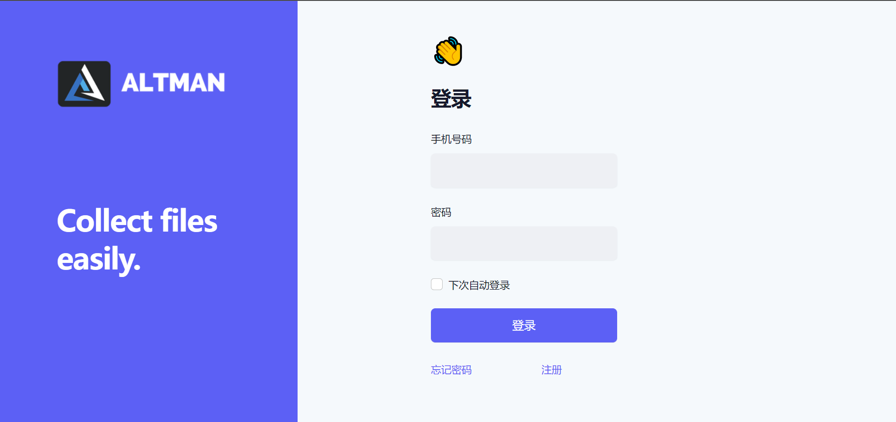
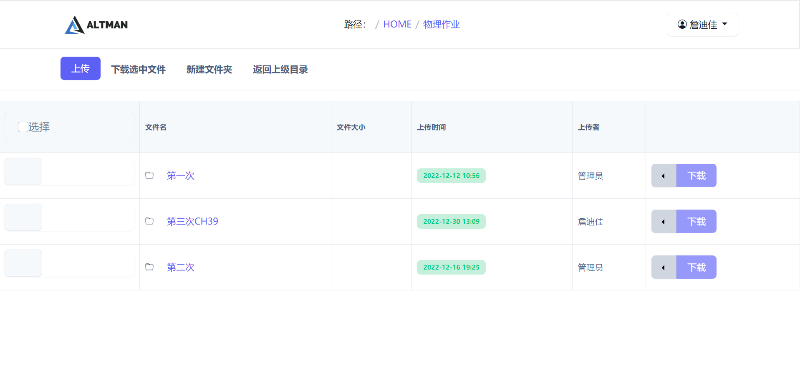

# FileCollector

**FileCollector** is based on Django, thus it is an easy way
to deploy a website on your server, providing many
features as listed below.

## Screenshots

**Login Page**


**Home Page**


## Features

* File Download  
  Users can download files from the website. It is based on
  StreamingHttpResponse.
* File Upload  
  Users can upload files to the website. Users select files
  from their local computer and upload them to the website.
* File Manipulation  
  Users can manipulate files on the website. For example,
  Users can rename, delete files on the website.
* User Privileges  
  Users is divided into two groups - admin and normal user.
  Admin users can do everything on the website, while normal
  users can only upload files and download specific files set
  by Admin users. Normal users have full control of their own files.
* File Sharing  
  Users can share files with other users. Admin users can
  set tht file to be share file such that normal users can
  download it. Admin users can also set the file to be private
  such that normal users cannot download it.
* SMS  
  The website can send SMS to users. It is based on
  Tencent's Cloud SMS service. Before using it, you need
  to make sure that you have a Tencent Cloud account and
  have applied for SMS service.
* Data Storage  
  The website can store data in MySQL database. It is based
  on Django's ORM. Before using it, you need to make sure
  that you have a MySQL database and have created a database
  for the website.

## Installation

1. You need to have a server with Python3 installed.  
   Then, you need to install the following packages listed
   in the requirements.txt file.
2. You need to customize the settings.py file according to
   your own needs. For example, you need to set the database and
   Tencent account.
3. Then, you can run the following command to initialize the database.

```bash
python3 manage.py makemigrations
python3 manage.py migrate
python3 manage.py collectstatic
```

4. Finally, you need to run the following command to start
   the website. You can change the port number (8000 here)
   according to your own needs.

```bash
python3 manage.py runserver 8000
```

